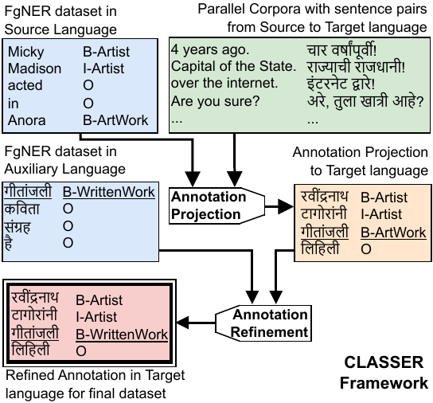

# [CLASSER: Cross-lingual Annotation Projection enhancement through Script Similarity for Fine-grained Named Entity Recognition](https://huggingface.co/datasets/prachuryyaIITG/CLASSER)

**CLASSER** is a framework for cross-lingual annotation projection with script-similarity-based refinement to create high-quality fine-grained named entity recognition datasets.

Utilizing CLASSER, fine-grained named entity recognition dataset is created in five languages: Assamese (as), Bodo (brx), Marathi (mr), Nepali (ne) and Sanskrit (as).

### The paper has been accepted for publication in IJCNLP-AACL 2025. [Read the Poster](CLASSER_AACL_2025_main-205.pdf)

## CLASSER Framework Overview



*Figure: Overview of the CLASSER framework.*

## CLASSER Dataset Statistics

<table>
<thead>
    <tr>
      <th rowspan="2">Language</th>
      <th colspan="3">Train set</th>
      <th colspan="3">Development set</th>
      <th colspan="4">Test set</th>
    </tr>
    <tr>
      <th>Sentences</th><th>Entities</th><th>Tokens</th>
      <th>Sentences</th><th>Entities</th><th>Tokens</th>
      <th>Sentences</th><th>Entities</th><th>Tokens</th><th>IAA&nbsp;(κ)</th>
    </tr>
  </thead>
  <tbody align="center">
    <tr>
      <td><b>Assamese (as)</b></td>
      <td>140,257</td><td>204,611</td><td>1,972,697</td>
      <td>15,585</td><td>15,763</td><td>219,114</td>
      <td>1,000</td><td>1,407</td><td>14,270</td><td><b>0.901</b></td>
    </tr>
    <tr>
      <td><b>Bodo (brx)</b></td>
      <td>212,835</td><td>302,713</td><td>2,958,455</td>
      <td>23,649</td><td>33,808</td><td>329,145</td>
      <td>1,000</td><td>1,423</td><td>14,082</td><td><b>0.875</b></td>
    </tr>
    <tr>
      <td><b>Marathi (mr)</b></td>
      <td>611,902</td><td>889,217</td><td>8,135,813</td>
      <td>67,990</td><td>97,943</td><td>948,020</td>
      <td>1,000</td><td>1,443</td><td>13,996</td><td><b>0.887</b></td>
    </tr>
    <tr>
      <td><b>Nepali (ne)</b></td>
      <td>414,561</td><td>617,957</td><td>5,531,683</td>
      <td>46,062</td><td>64,098</td><td>642,489</td>
      <td>1,000</td><td>1,436</td><td>14,142</td><td><b>0.882</b></td>
    </tr>
    <tr>
      <td><b>Sanskrit (sa)</b></td>
      <td>265,114</td><td>378,287</td><td>3,488,871</td>
      <td>29,458</td><td>40,589</td><td>377,306</td>
      <td>1,000</td><td>1,412</td><td>12,925</td><td><b>0.861</b></td>
    </tr>
  </tbody>
</table>

*Note: IAA (Inter-Annotator Agreement) scores are represented using Cohen's κ.*

## 🚀 How to Use

### Loading the Dataset

```python
from datasets import load_dataset
dataset = load_dataset("prachuryyaIITG/CLASSER")

```

## 🚀 More resources
* [CLASSER Dataset](https://huggingface.co/datasets/prachuryyaIITG/CLASSER)
* [Fine-tuned models](https://huggingface.co/collections/prachuryyaIITG/classer)
* [Interactive Demo](https://huggingface.co/spaces/prachuryyaIITG/AWED-FiNER)
* [Agentic tool: AWED-FiNER](https://github.com/PrachuryyaKaushik/AWED-FiNER)


## Citation

If you use this dataset, please cite the following paper:

```bibtex
@inproceedings{kaushik2025classer,
  title     = {{CLASSER}: Cross-lingual Annotation Projection enhancement through Script Similarity for Fine-grained Named Entity Recognition},
  author    = {Kaushik, Prachuryya and Anand, Ashish},
  booktitle = {Proceedings of the 14th International Joint Conference on Natural Language Processing and the 4th Conference of the Asia-Pacific Chapter of the Association for Computational Linguistics},
  year      = {2025},
  publisher = {Association for Computational Linguistics},
```

